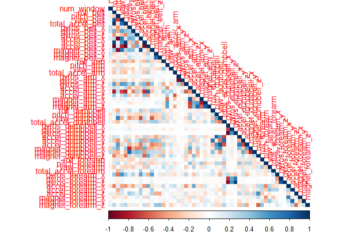

Course Assignment
================
Elise Rivas

Practical Machine Learning: Prediction Assignment Write-Up
==========================================================

Using the caret package and classification machine learning techniques, we predict the manner of exercise a participant was doing using metrics from fitness performance devices, such as a FitBit.

This analysis requires the caret package and use of cross-validation to predict the "classe" variable, which labels the exercise as A, B, C, D or E. In this dataset there are 6 participants who were asked to perform barbell lifts correctly and incorrectly in 5 different ways (A-E).

The final model will be tested on 20 cases for accuracy

Data Exploration
----------------

Load in appropriate libraries

Read in the csvs with the training and testing data

``` r
set.seed(555)

setwd("C:/Users/elrivas/Documents/Trainings/JHU/Class8")
train <- read.csv("pml-training.csv")
test <- read.csv("pml-testing.csv")
```

Explore columns and their characteristics

``` r
col_sums <- colSums(is.na(train))/nrow(train)
length(which(col_sums > 0.97))
```

    ## [1] 67

67 out of the 160 columns are more than 97% NA. This suggests these variables are likely not predictive and can be eliminated.

Preprocessing
-------------

``` r
# Remove timestamp, name, and row variables
train <- train[,-c(1:5)]
test <- test[,-c(1:5)]
```

Timestamp and name variables will carry no predictive weight in the final model. They can be removed.

``` r
# Find variables with little variance, which are likely not predictive
nz <- nearZeroVar(train)
length(nz)
```

    ## [1] 60

``` r
train <- train[,-nz]
test <- test[-nz]
```

60 of the remaining 155 columns have near zero variance, implying that they won't indicate much about which action is being performed by the participant.

``` r
# If above 95% NA, get rid of column
perc_NA <- colSums(is.na(train))/nrow(train)
na_index <- which(perc_NA>0.95)
train <- train[,-na_index]
test <- test[,-na_index]
```

41 of the remaining columns are more than 95% NA, eliminate them.

Explore relationships between columns

``` r
corrplot(cor(train[,-54]), method="color", type="lower") # most are uncorrelated
```

 Few of the remaining columns are highly correlated, so we will keep them.

Partition Data and Make Cross Validation Settings
-------------------------------------------------

``` r
split <- createDataPartition(train$classe, p = .75, list=FALSE)
training <- train[split,]
testing <- train[-split,]

train_control<- trainControl(method="cv", number=3, savePredictions = TRUE)
```

We split the data 75/25 into the train and test set. Using the trainControl function, we set the parameters for crosss validation, which splits the data into 3 sections, using 2/3 as the training set for each iteration.

Models
------

### Out Of Sample Estsimation

For each of the models, the out of sample error will most likely be more than the in sample error. Because the model wasn't trained on the the test data, it makes sense that the foreign data will produce a larger error than the training, familiar data.

### Random Forest

``` r
# Reduce number of trees from 500 to 200 to increase processing speed
mod_rf<- train(classe~., data=training, trControl=train_control, method="rf", ntree=200)
mod_rf$results
```

    ##   mtry  Accuracy     Kappa  AccuracySD     KappaSD
    ## 1    2 0.9923224 0.9902875 0.001045460 0.001322763
    ## 2   27 0.9962632 0.9952730 0.001227911 0.001553601
    ## 3   53 0.9924584 0.9904594 0.001410715 0.001785117

``` r
mod_rf$finalModel
```

    ## 
    ## Call:
    ##  randomForest(x = x, y = y, ntree = 200, mtry = param$mtry) 
    ##                Type of random forest: classification
    ##                      Number of trees: 200
    ## No. of variables tried at each split: 27
    ## 
    ##         OOB estimate of  error rate: 0.2%
    ## Confusion matrix:
    ##      A    B    C    D    E class.error
    ## A 4185    0    0    0    0 0.000000000
    ## B   10 2835    2    1    0 0.004564607
    ## C    0    4 2563    0    0 0.001558239
    ## D    0    0    8 2403    1 0.003731343
    ## E    0    0    0    3 2703 0.001108647

``` r
pred_rf <- predict(mod_rf, newdata = testing)
confusionMatrix(pred_rf, testing$classe) # 99.86%
```

    ## Confusion Matrix and Statistics
    ## 
    ##           Reference
    ## Prediction    A    B    C    D    E
    ##          A 1393    0    0    0    0
    ##          B    1  948    1    0    0
    ##          C    0    0  854    3    0
    ##          D    0    1    0  801    0
    ##          E    1    0    0    0  901
    ## 
    ## Overall Statistics
    ##                                           
    ##                Accuracy : 0.9986          
    ##                  95% CI : (0.9971, 0.9994)
    ##     No Information Rate : 0.2845          
    ##     P-Value [Acc > NIR] : < 2.2e-16       
    ##                                           
    ##                   Kappa : 0.9982          
    ##  Mcnemar's Test P-Value : NA              
    ## 
    ## Statistics by Class:
    ## 
    ##                      Class: A Class: B Class: C Class: D Class: E
    ## Sensitivity            0.9986   0.9989   0.9988   0.9963   1.0000
    ## Specificity            1.0000   0.9995   0.9993   0.9998   0.9998
    ## Pos Pred Value         1.0000   0.9979   0.9965   0.9988   0.9989
    ## Neg Pred Value         0.9994   0.9997   0.9998   0.9993   1.0000
    ## Prevalence             0.2845   0.1935   0.1743   0.1639   0.1837
    ## Detection Rate         0.2841   0.1933   0.1741   0.1633   0.1837
    ## Detection Prevalence   0.2841   0.1937   0.1748   0.1635   0.1839
    ## Balanced Accuracy      0.9993   0.9992   0.9990   0.9980   0.9999

The Random Forest algorithm has strong predictive power. It's the result of many decision trees, where the top node is limited to a different set of variables each time to reduce bias. It allows each variable to be the main predictor.

### GBM

``` r
train_control_boost <- trainControl(method="repeatedcv", number=3, repeats = 1)
mod_gbm <- train(classe~., data=training, method="gbm", trControl= train_control_boost, verbose = F)
mod_gbm$results
```

    ##   shrinkage interaction.depth n.minobsinnode n.trees  Accuracy     Kappa
    ## 1       0.1                 1             10      50 0.7581868 0.6932370
    ## 4       0.1                 2             10      50 0.8810973 0.8494642
    ## 7       0.1                 3             10      50 0.9302210 0.9116861
    ## 2       0.1                 1             10     100 0.8329245 0.7884704
    ## 5       0.1                 2             10     100 0.9400729 0.9241650
    ## 8       0.1                 3             10     100 0.9720750 0.9646730
    ## 3       0.1                 1             10     150 0.8688678 0.8340934
    ## 6       0.1                 2             10     150 0.9618155 0.9516798
    ## 9       0.1                 3             10     150 0.9850523 0.9810902
    ##     AccuracySD     KappaSD
    ## 1 0.0053621551 0.006626575
    ## 4 0.0098993123 0.012476222
    ## 7 0.0039314532 0.004983520
    ## 2 0.0119066493 0.014947603
    ## 5 0.0064302161 0.008145075
    ## 8 0.0008891793 0.001122329
    ## 3 0.0082650323 0.010374424
    ## 6 0.0020400827 0.002578239
    ## 9 0.0006216818 0.000787116

``` r
mod_gbm$finalModel
```

    ## A gradient boosted model with multinomial loss function.
    ## 150 iterations were performed.
    ## There were 53 predictors of which 40 had non-zero influence.

``` r
pred_gbm <- predict(mod_gbm, newdata = testing)
confusionMatrix(pred_gbm, testing$classe) # 98.88%
```

    ## Confusion Matrix and Statistics
    ## 
    ##           Reference
    ## Prediction    A    B    C    D    E
    ##          A 1393    9    0    0    0
    ##          B    2  932   11    2    2
    ##          C    0    7  839   11    0
    ##          D    0    1    5  791    6
    ##          E    0    0    0    0  893
    ## 
    ## Overall Statistics
    ##                                           
    ##                Accuracy : 0.9886          
    ##                  95% CI : (0.9852, 0.9914)
    ##     No Information Rate : 0.2845          
    ##     P-Value [Acc > NIR] : < 2.2e-16       
    ##                                           
    ##                   Kappa : 0.9856          
    ##  Mcnemar's Test P-Value : NA              
    ## 
    ## Statistics by Class:
    ## 
    ##                      Class: A Class: B Class: C Class: D Class: E
    ## Sensitivity            0.9986   0.9821   0.9813   0.9838   0.9911
    ## Specificity            0.9974   0.9957   0.9956   0.9971   1.0000
    ## Pos Pred Value         0.9936   0.9821   0.9790   0.9851   1.0000
    ## Neg Pred Value         0.9994   0.9957   0.9960   0.9968   0.9980
    ## Prevalence             0.2845   0.1935   0.1743   0.1639   0.1837
    ## Detection Rate         0.2841   0.1900   0.1711   0.1613   0.1821
    ## Detection Prevalence   0.2859   0.1935   0.1748   0.1637   0.1821
    ## Balanced Accuracy      0.9980   0.9889   0.9884   0.9905   0.9956

This boosted tree model requires a boosted sampling method, so we change the trainControl. GBM weighs the incorrect predictions and performs different iterations until the best result is produced. This model is also a good predictor, but not quite as good as the Random Forest.

### K Nearest Neighbor (KNN)

``` r
mod_knn <- train(classe~., data=training, trControl=train_control, method='kknn')
mod_knn$results
```

    ##   kmax distance  kernel  Accuracy     Kappa  AccuracySD     KappaSD
    ## 1    5        2 optimal 0.9821307 0.9773968 0.001733571 0.002194125
    ## 2    7        2 optimal 0.9821307 0.9773968 0.001733571 0.002194125
    ## 3    9        2 optimal 0.9821307 0.9773968 0.001733571 0.002194125

``` r
mod_knn$finalModel
```

    ## 
    ## Call:
    ## kknn::train.kknn(formula = .outcome ~ ., data = dat, kmax = param$kmax,     distance = param$distance, kernel = as.character(param$kernel))
    ## 
    ## Type of response variable: nominal
    ## Minimal misclassification: 0.009172442
    ## Best kernel: optimal
    ## Best k: 1

``` r
pred_knn <- predict(mod_knn, newdata=testing)
confusionMatrix(pred_knn, testing$classe) # 99.33
```

    ## Confusion Matrix and Statistics
    ## 
    ##           Reference
    ## Prediction    A    B    C    D    E
    ##          A 1387    6    0    0    0
    ##          B    3  937    2    0    2
    ##          C    3    4  848    2    0
    ##          D    1    0    5  802    2
    ##          E    1    2    0    0  897
    ## 
    ## Overall Statistics
    ##                                           
    ##                Accuracy : 0.9933          
    ##                  95% CI : (0.9906, 0.9954)
    ##     No Information Rate : 0.2845          
    ##     P-Value [Acc > NIR] : < 2.2e-16       
    ##                                           
    ##                   Kappa : 0.9915          
    ##  Mcnemar's Test P-Value : NA              
    ## 
    ## Statistics by Class:
    ## 
    ##                      Class: A Class: B Class: C Class: D Class: E
    ## Sensitivity            0.9943   0.9874   0.9918   0.9975   0.9956
    ## Specificity            0.9983   0.9982   0.9978   0.9980   0.9993
    ## Pos Pred Value         0.9957   0.9926   0.9895   0.9901   0.9967
    ## Neg Pred Value         0.9977   0.9970   0.9983   0.9995   0.9990
    ## Prevalence             0.2845   0.1935   0.1743   0.1639   0.1837
    ## Detection Rate         0.2828   0.1911   0.1729   0.1635   0.1829
    ## Detection Prevalence   0.2841   0.1925   0.1748   0.1652   0.1835
    ## Balanced Accuracy      0.9963   0.9928   0.9948   0.9978   0.9974

The K Nearest Neighbor algorithm uses distance to quantify similarity. Unlike the other models, it is not tree based. It proves to be an accurate predictor, still not quite as strong as the Random Forest. Perhaps under a different seed number it would outperform.

Best Model
----------

Random forest is the best model. Now we will use it to predict the 20 test cases

``` r
valid_pred_rf <- predict(mod_rf, newdata=test)
valid_pred_rf
```

    ##  [1] B A B A A E D B A A B C B A E E A B B B
    ## Levels: A B C D E
